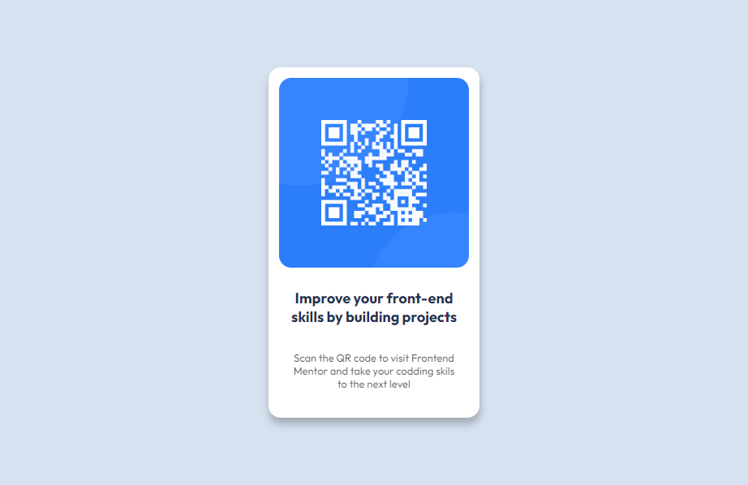

# Frontend Mentor - QR code component solution

This is a solution to the [QR code component challenge on Frontend Mentor](https://www.frontendmentor.io/challenges/qr-code-component-iux_sIO_H). Frontend Mentor challenges help you improve your coding skills by building realistic projects.

## Table of contents

- [Overview](#overview)
  - [Screenshot](#screenshot)
  - [Links](#links)
- [My process](#my-process)
  - [Built with](#built-with)
  - [What I learned](#what-i-learned)
  - [Continued development](#continued-development)
  - [Useful resources](#useful-resources)
- [Author](#author)
- [Acknowledgments](#acknowledgments)

**Note: Delete this note and update the table of contents based on what sections you keep.**

## Overview

### Screenshot




**Note: Delete this note and the paragraphs above when you add your screenshot. If you prefer not to add a screenshot, feel free to remove this entire section.**

### Links

- Solution URL: [Add solution URL here](https://your-solution-url.com)
- Live Site URL:(https://animated-toffee-fc6fcc.netlify.app/)

## My process

### Built with

- Semantic HTML5 markup
- CSS custom properties
- Flexbox
- CSS Grid
- Media queries

### What I learned

I have the opportunity to learn how to place contents and items at the center using grid.

```css
.proud-of-this-css {
  display: grid;
  place-items: center;
}
```

### Continued development

I would like to fine tune my understanding of Grid and media queries

## Author

- Website - [AdedokunTimileyin](https://www.linkedin.com/in/timileyin-adedokun-35b36b219)
- Frontend Mentor - [@TImley53](https://www.frontendmentor.io/profile/yourusername)
- Twitter - [@timley_kun](https://www.twitter.com/yourusername)
